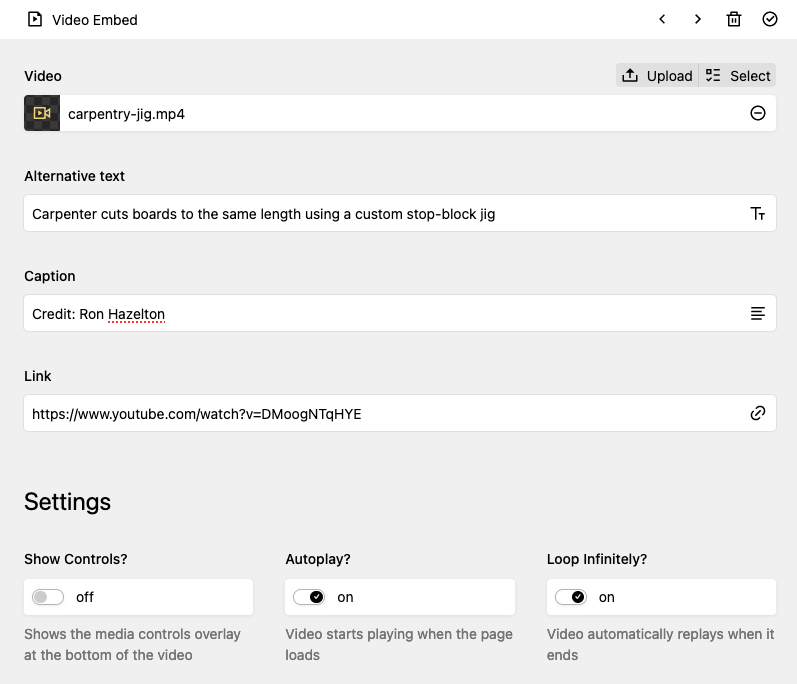

# Kirby Video Embed Block

I was surprised to find that the [default Kirby v4 `video` block](https://getkirby.com/docs/reference/panel/blocks/video) doesn't support a way to upload and embed a video - so here it is.



## Install

There's a couple ways to install this plugin (and you can read more in Kirby docs [here](https://getkirby.com/docs/guide/plugins/installing-plugins))

### 1. Download

Download this repo, and place its contents in `/site/plugins/kirby-video-embed-block`

### 2. Git

If you version control your project, you can add this plugin as a git submodule

```
❯ git submodule add git@github.com:vyder/kirby-video-embed-block.git site/plugins/kirby-video-embed-block
```

### 3. Kirby CLI

```
❯ kirby plugin:install https://github.com/vyder/kirby-video-embed-block.git
```

## Usage

To add the ability to use `VideoEmbed` blocks in your page, you need to update the blueprint as follows:

```
fields:
    text:
        type: blocks
        fieldsets:
            - code
            - gallery
            - heading
            - image
            - line
            - list
            - markdown
            - quote
            - table
            - text
            - video
            - video-embed
```

So here, the `text` field is set as blocks, and specifies all the blocks available.

I would love if this plugin could just extend the default list of blocks in some way - but it doesn't seem possible as of now.

If this gets outdated, you can find the default list of kirby blocks [here](https://getkirby.com/docs/guide/page-builder#core-block-types).

## License

MIT

## Contribute

Feel free to open issues if you think of features / encounter bugs - I'd be happy to take a look.
